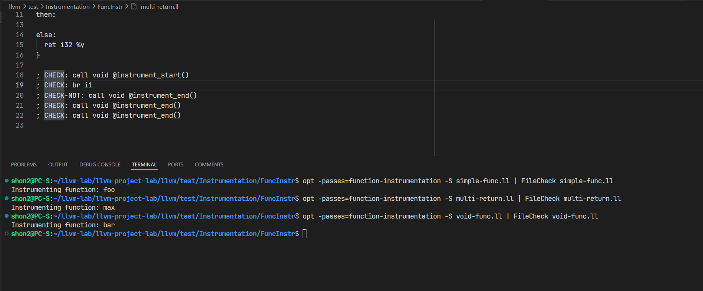
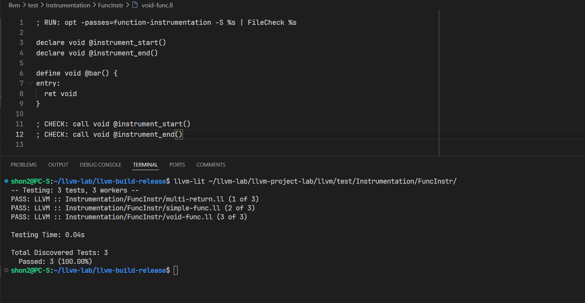

# Руководство по обращению с проектом
## Сборка проекта
1. Чтобы собрать / пересобрать проект, нужно обновить targets для сборщика
```sh
mkdir llvm-build-release && cd llvm-build-release
cmake ../llvm-project-lab/llvm   \
    -DCMAKE_BUILD_TYPE=Release   \
    -DLLVM_ENABLE_ASSERTIONS=ON  \
    -DLLVM_ENABLE_PROJECTS=clang \
    -DLLVM_TARGETS_TO_BUILD=X86
```
2. Запускаем сборку всех таргетов из исходников
```sh
cmake --build . --target opt
```

## Сборка и запуск плагина
1. Добавляем путь до `opt` в переменные окружения
```
export PATH=$PATH:~/llvm-lab/llvm-build-release/bin
```
2. Проверяем тесты через ручной запуск
```
cd ~/llvm-lab/llvm-project-lab/llvm/test/Instrumentation/FunсInstr
opt -passes=function-instrumentation -S simple-func.ll | FileCheck simple-func.ll
```

3. Либо через lit
```
llvm-lit ~/llvm-lab/llvm-project-lab/llvm/test/Instrumentation/FunсInstr/
```

