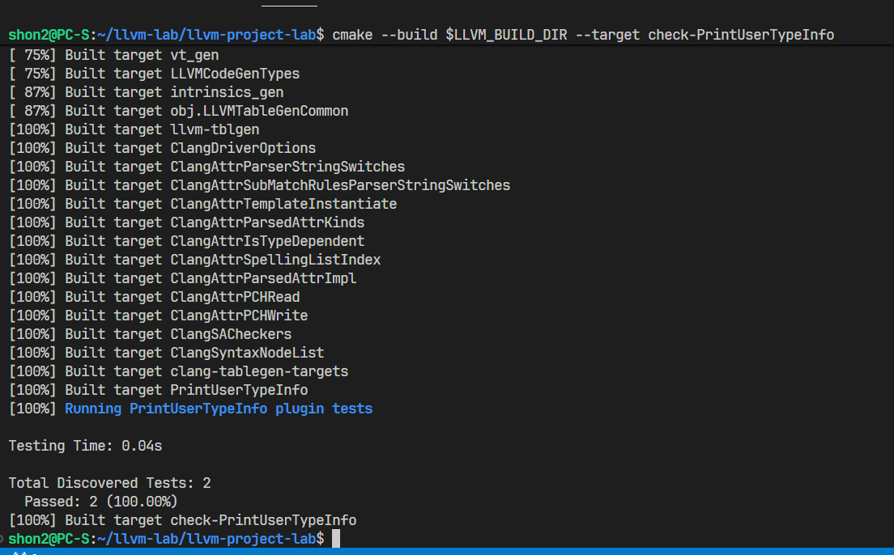
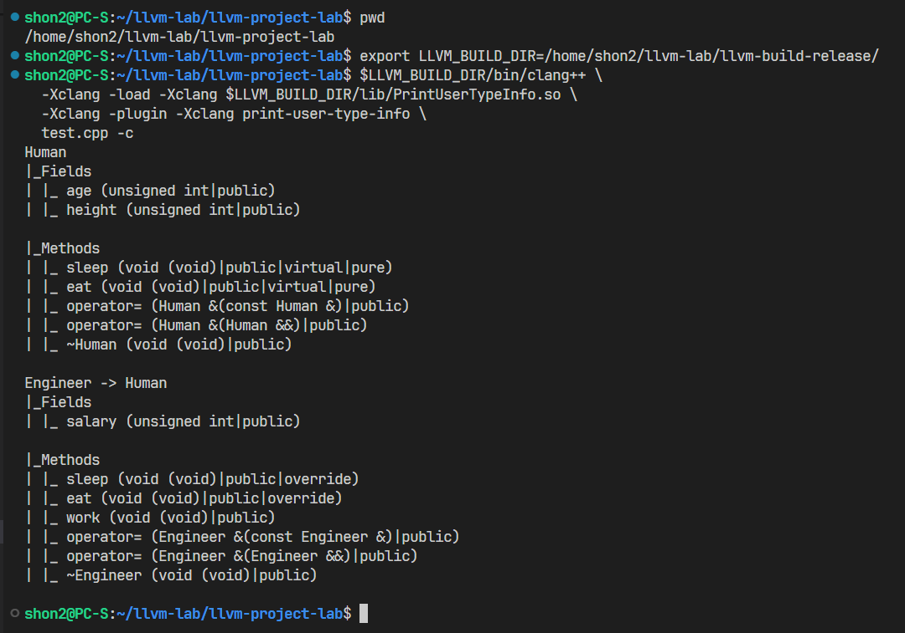

# Руководство по обращению с проектом
## Сборка проекта
1. Чтобы собрать / пересобрать проект, нужно обновить targets для сборщика
```sh
mkdir llvm-build-release && cd llvm-build-release
cmake ../llvm-project-lab/llvm   \
    -DCMAKE_BUILD_TYPE=Release   \
    -DLLVM_ENABLE_ASSERTIONS=ON  \
    -DLLVM_ENABLE_PROJECTS=clang \
    -DLLVM_TARGETS_TO_BUILD=X86
```
2. Запускаем сборку всех таргетов из исходников
```sh
cmake --build .
```

## Сборка и запуск плагина
1. Аналогично сборке проекта нужно так же обновить targets, только добавив ещё флаг `-DBUILD_TESTING=ON` для добавления тестов нашему плагину
2. Указыаем путь до собранного llvm в env `LLVM_BUILD_DIR`
3. Собираем (из llvm-build-release) нужный нам плагин с тестированием:
```
cmake --build $LLVM_BUILD_DIR --target check-PrintUserTypeInfo
```

3. Запускаем плагин
```
$LLVM_BUILD_DIR/bin/clang++ \
  -Xclang -load -Xclang $LLVM_BUILD_DIR/lib/PrintUserTypeInfo.so \
  -Xclang -plugin -Xclang print-user-type-info \
  test.cpp -c
```

